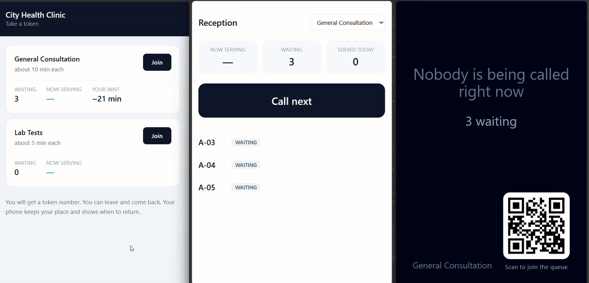

# UpNext

A digital token system for places where you currently wait by standing within
earshot of someone calling names.



## The problem

I sat for two hours in a small clinic that sees about 100 patients a day. There
is no appointment system. A receptionist writes your name in a notebook and
calls it out when your turn comes.

The notebook is not the problem. It keeps fair order and it never crashes. The
problem is that **the only way to learn your turn is to stand close enough to
hear one person's voice.** A voice carries about twenty feet, so a hundred
people sit in one room for hours, most of them needing ten minutes.

And the penalty for getting it wrong is severe: miss your name and you start
again at the back. So nobody risks stepping out, even for five minutes.

Large hospitals have OPD apps and big restaurants hand you a buzzer. That
solution never reached the small clinic.

[**PROBLEM.md**](PROBLEM.md) has the full write-up: what goes wrong, why a
token machine alone does not fix it, and what this does *not* solve.

## What it does

Three screens over one queue, kept consistent in real time.

| | Who | What they see |
|---|---|---|
| `/` → `/ticket/:id` | the patient's phone | Token, people ahead, when to come back, cancel |
| `/staff` | the reception desk | One **Call next** button, plus Done / Not here / Call back |
| `/display` | the screen on the wall | One number, readable from the back of the room |

The patient screen is the point. You can leave, and your phone keeps your place.

Two decisions that fall out of the problem rather than out of a feature list:

**The wait estimate leans early, deliberately.** Say 45 minutes when it is
really 20 and the patient goes far away, misses their turn, and lands at the
back of the line, which is worse than the notebook. Say 20 when it is really 45 and they
come back early and sit down. The errors are not symmetric, so the screen shows
"be back in about 20 minutes", not the upper bound.

**The wall display shows a token, never a name.** Calling a name across a
waiting room tells everyone present who you are and which doctor you are seeing.
`A-07` tells them nothing.

## Measured behaviour

Numbers from running the code, not from reading it.

### 100 patients joining at the same instant

| Code state | Tokens issued | Refused |
|---|---|---|
| As originally written | **1** | 99 |
| After `upsert` for the queue-of-the-day | **19** | 81 |
| After atomic token counter | **100** | 0 |

Three separate races, and the first masked the other two.

1. Every request looked for today's queue, none found it, all 100 tried to
   create it. One won.
2. With that fixed, requests reached the real bug: `MAX(tokenNumber) + 1` at
   PostgreSQL's default Read Committed isolation, where concurrent transactions
   see the same maximum. The unique constraint rejected the losers, so the data
   stayed correct and 81 patients got an error instead of a token.
3. Fixed by claiming tokens with
   `UPDATE … SET lastTokenNumber = lastTokenNumber + 1 RETURNING`, which takes a
   row lock and re-reads under it.

### Two counters calling at once

```
counter 1 called A-01, counter 2 called A-02
```

Worse than the join race, because **nothing in the schema catches it**: both
transactions read the lowest waiting ticket, both update it, and the second
write wins silently. Fixed with `SELECT … FOR UPDATE SKIP LOCKED`.
`SKIP LOCKED` rather than plain locking, because counter 2 should not *wait* for
counter 1. It should take the next patient, which is what two counters working
side by side do.

### Reproduce

```bash
docker compose up -d
cd backend && npm install && npm test
```

## Running it

Requires Node 20+ and Docker.

```bash
# 1. PostgreSQL
docker compose up -d

# 2. Backend at http://localhost:3001
cd backend
cp .env.example .env          # then edit if you want a different staff key
npm install                   # postinstall generates the Prisma client
npx prisma migrate deploy
npm run db:seed
npm run dev

# 3. Frontend at http://localhost:5173
cd ../frontend
npm install
npm run dev
```

Then open three tabs: `/`, `/staff`, `/display`. The staff dashboard asks once
for the key from `STAFF_KEY` in `backend/.env`.

### If it does not start

**`failed to connect to the docker API`**: Docker is installed but not running.
Start Docker Desktop and wait for it to finish starting, then try again.

**`port is already allocated`** on 5432: something else is already running
PostgreSQL. Stop it, or change the host port in `docker-compose.yml` to
`5433:5432` and update `DATABASE_URL` in `backend/.env` to match.

**The page loads but every number shows `—`**: the backend is not running, or
is not on port 3001. Check http://localhost:3001/api/health returns
`{"status":"ok"}`.

**The staff dashboard asks for a key**: that is expected. It is `STAFF_KEY`
from `backend/.env`, and it is only asked once per browser.

## Using it for your own place

The venue is data, not code. Nothing in the schema knows what a clinic is. The
tables are `Organization`, `Service`, `Queue` and `Ticket`, so changing the
venue means changing rows.

Edit `backend/prisma/seed.ts`:

```ts
name: 'City Health Clinic'        // your name

name: 'General Consultation',     // what people queue for
prefix: 'A',                      // tokens become A-01, A-02 ...
averageServiceTime: 10,           // minutes, drives the wait estimate
```

Then `npm run db:seed` and it is your queue.

One rule when choosing services: **a service is a line with its own server**,
not a thing a customer can ask for. A clinic with a doctor and a lab technician
is two services. One person offering two kinds of appointment is *one* service,
and splitting it would make the system call two people at once.

Also change `STAFF_KEY` in `backend/.env` before anyone else can reach it.

### Running it somewhere real

Build the frontend and serve it from the same Express process, so you deploy one
Node process plus PostgreSQL. The wall display's QR code is generated from
whatever address is serving the page, so it starts pointing at the right place
on its own.

For a single clinic you may not need a server at all: run it on the reception
computer with `npm run dev:lan`, and phones on the clinic's wifi can reach it.
That costs nothing and survives the internet going down, but it only works
while people stay on that wifi, so it suits somewhere people wait just outside
rather than walking away.

## How it works

```
  patient phone ─┐
  reception     ─┼─ REST  (what is true) ──┐
  wall display  ─┘                          ├─ Express ── Prisma ── PostgreSQL
                 └─ Socket.IO (what changed)┘
```

**The socket is a hint, not the source of truth.** It says something changed;
REST says what is actually true. Every screen reads over REST when it mounts and
again after every reconnect, and treats events as updates on top of state it
already trusts.

Without that, a phone that loses signal reconnects to a live socket and sits
there showing a ten-minute-old queue, with no error and no spinner, just
confidently wrong. That is worse than no real-time at all, because the patient has no reason
to doubt it.

One `QUEUE_UPDATED` event covers every change rather than six fine-grained ones.
Every screen wants the same thing: the current state of the queue. A
fine-grained event that a client forgets to handle becomes a screen that
silently goes stale. The payload carries the state identical for every viewer,
so the wall display re-renders without making a request. It cannot carry a
patient's own position, since that differs per viewer, so phones refetch their
own ticket, but only on actions that could have moved them. Someone joining
*behind* you does not change your position.

See [docs/ARCHITECTURE.md](docs/ARCHITECTURE.md) for the data model, the ticket
state machine, and the event flow.

## API

| | |
|---|---|
| `GET /api/organization` | Which venue this is |
| `GET /api/services` | What you can queue for |
| `POST /api/queues/:serviceId/join` | Take a token |
| `GET /api/queues/:serviceId/status` | Now serving, how many waiting |
| `GET /api/tickets/:ticketId` | One ticket, with position and estimate |
| `POST /api/tickets/:ticketId/cancel` | Give up your place |

Staff routes require an `x-staff-key` header.

| | |
|---|---|
| `GET /api/staff/queues/:serviceId` | Full queue with every ticket |
| `POST /api/staff/queues/:serviceId/call-next` | Call the next patient |
| `POST /api/staff/tickets/:ticketId/complete` | Done |
| `POST /api/staff/tickets/:ticketId/skip` | Not here |
| `POST /api/staff/tickets/:ticketId/recall` | Call back in |

## Stack

| | | Why |
|---|---|---|
| PostgreSQL | 16 | Row locks and `SKIP LOCKED` are the fix for two of the three races |
| Prisma | 7 | Typed queries; raw SQL where it cannot express a lock clause |
| Express | 5 | Small, and the interesting parts are not in the framework |
| Socket.IO | 4 | Rooms, heartbeats and reconnection with backoff, rather than hand-rolling them |
| React | 19 | |
| Vite + Tailwind | 8 / 4 | |
| Vitest | 5 | Tests run against a real PostgreSQL; a mocked client cannot prove an isolation-level bug |

## What this does not do

Stated plainly because they are real.

- **It does not notify you.** The socket only updates an open page, so a patient
  whose phone is in their pocket has to look. A push notification when you are
  two away is the most valuable thing left to build.
- **Every person in a queue is assumed to take about the same time.**
  `averageServiceTime` belongs to the service, not the ticket. That works where a
  queue is one kind of job, but a single line mixing a 25-minute job with a
  10-minute one would show an estimate that is wrong for most people in it, and
  the estimate is the whole reason someone feels safe leaving.
- **It does not make the doctor faster.** It moves waiting out of the room; it
  does not remove it.
- **It does not help someone without a smartphone.** The wall display is there
  for them, but they still have to stay nearby.
- **It is not for emergency rooms.** Those triage; this is first-come-first-served
  by design.
- **The staff key is a lock, not an identity.** It stops a patient calling the
  next person in. It cannot say which member of staff acted, so it cannot support
  an audit trail. Real deployment needs per-user accounts.
- **One Socket.IO process holds every connection.** More than one instance would
  need a Redis adapter and sticky sessions.

## License

MIT
